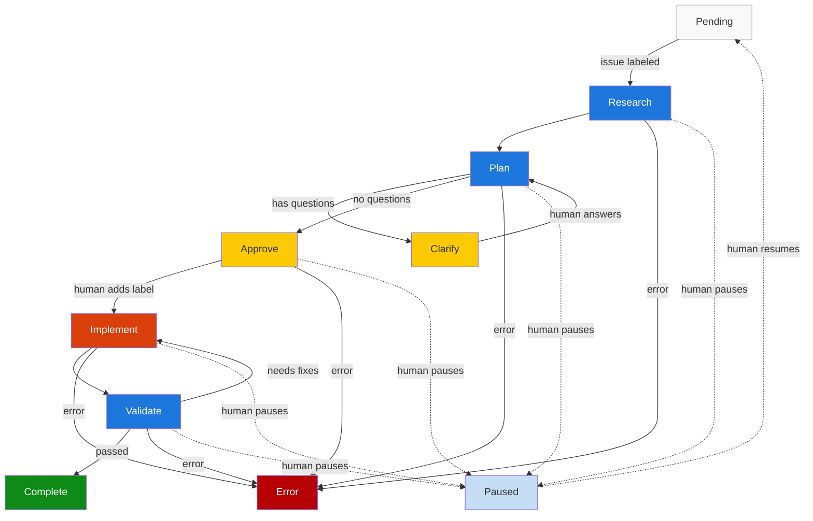
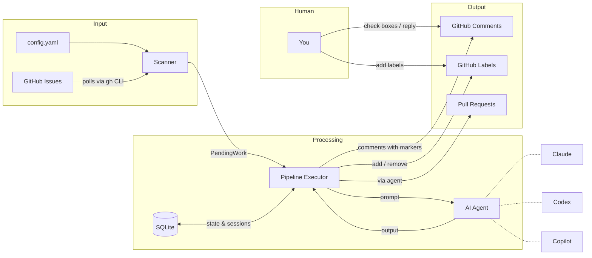

# dayshift

**It turns your issues into PRs, one phase at a time.**

Dayshift is an issue-driven AI agent pipeline that processes GitHub issues through structured phases — Research, Plan, Approve, Implement, and Validate — with human-in-the-loop checkpoints between them.

Inspired by [nightshift](https://github.com/marcus/nightshift), which runs AI coding agents autonomously overnight. While nightshift works while you sleep, dayshift works while you're awake — pausing for your input and resuming when you respond.

## Overview

Add a `dayshift` label to any GitHub issue. Dayshift picks it up, researches your codebase, drafts an implementation plan, asks clarifying questions if needed, waits for your approval, implements the change, validates the result, and opens a PR — all tracked through labels and comments on the issue itself.





## Features

- **Multi-project** — monitor multiple repositories from a single config
- **Session resume** — Copilot sessions persist across phases so the agent retains context
- **Human-in-the-loop** — the pipeline pauses at clarify and approve checkpoints, resuming when you respond
- **Labels as state machine** — every phase transition is visible on the issue as a label change
- **Edit-in-place comments** — plan updates edit the existing comment instead of posting new ones
- **Multiple AI providers** — supports Claude, Codex, and Copilot with configurable preference order
- **Daemon mode** — run as a background polling service or trigger manually

## Installation

### From source

```bash
go install github.com/marcus/dayshift/cmd/dayshift@latest
```

### Binary downloads

Prebuilt binaries for macOS and Linux (amd64, arm64) are available on the [Releases](https://github.com/marcus/dayshift/releases) page.

## Quick Start

```bash
# 1. Create a config file
dayshift init

# 2. Edit ~/.config/dayshift/config.yaml to add your projects

# 3. Create labels on your repositories
dayshift labels setup

# 4. Add the "dayshift" label to a GitHub issue

# 5. Run
dayshift run
```

## CLI Reference

| Command | Description |
|---|---|
| `dayshift run` | Process pending issues. Use `--issue` to target one, `--dry-run` to preview. |
| `dayshift status` | Show tracked issues and recent runs. Use `--issue` for details. |
| `dayshift doctor` | Check config, tools (`gh`, `claude`, `codex`, `copilot`), and database health. |
| `dayshift daemon start` | Start the background polling daemon. `--foreground` to stay attached. |
| `dayshift daemon stop` | Stop the daemon (SIGTERM, then SIGKILL after 10s). |
| `dayshift daemon status` | Check whether the daemon is running. |
| `dayshift labels setup` | Create all 13 dayshift labels on configured repos. `--repo` to target one. |
| `dayshift init` | Generate `~/.config/dayshift/config.yaml`. `--force` to overwrite. |

See [docs/cli-reference.md](docs/cli-reference.md) for the full reference with all flags and examples.

## Configuration

Config lives at `~/.config/dayshift/config.yaml`. Run `dayshift init` to generate a starter file.

```yaml
projects:
  - repo: owner/repo
    path: ~/code/repo
    priority: 10

schedule:
  poll_interval: 5m

labels:
  trigger: dayshift
  prefix: "dayshift:"

provider:
  preference: [claude, copilot, codex]
  timeout: 30m
  claude:
    enabled: true
    dangerously_skip_permissions: true
  codex:
    enabled: true
    dangerously_bypass_approvals_and_sandbox: true
  copilot:
    enabled: true

budget:
  mode: daily
  max_percent: 100

phases:
  research:
    enabled: true
  plan:
    enabled: true
    max_clarify_rounds: 3
  approve:
    enabled: true
    auto_approve: false
  implement:
    enabled: true
  validate:
    enabled: true

logging:
  level: info
  path: ~/.local/share/dayshift/logs
  format: json
```

See [docs/configuration.md](docs/configuration.md) for the full configuration reference.

## How It Works

### Phase 1: Research

The AI agent reads the issue and researches the relevant parts of your codebase. Its findings are posted as a comment on the issue wrapped in `<!-- dayshift:research -->` markers. The `dayshift:researched` label is added.

### Phase 2: Plan

Using the research output, the agent drafts an implementation plan. If it has questions, they're posted as checkboxes in a `<!-- dayshift:questions -->` section and the issue moves to **Clarify**. If no questions, the plan is posted (or edited in-place if updating) and the issue moves to **Approve**.

### Phase 2a: Clarify

The pipeline pauses. You answer by checking boxes or replying with a comment. On the next scan, dayshift detects your response and re-runs the plan phase with your answers folded in. This loops up to `max_clarify_rounds` times (default: 3).

### Phase 3: Approve

A comment is posted asking you to review the plan. Add the `dayshift:approved` label when you're ready. If `auto_approve` is enabled, this step is skipped.

### Phase 4: Implement

The agent creates a branch, implements the plan, and opens a pull request with `Fixes #N` in the description. The PR URL is stored in the database for the next phase.

### Phase 5: Validate

The agent reviews the PR against the original issue and plan. If validation passes, the issue is marked `dayshift:complete`. If it fails, `dayshift:needs-fixes` is added and the issue can cycle back through implementation.

### Error Handling

If any phase fails, the `dayshift:error` label is added and a comment with the error details is posted. Remove the error label and re-add `dayshift` to retry.

## Label Protocol

Dayshift uses 13 labels to track state. Run `dayshift labels setup` to create them.

| Label | Color | Meaning | Set By |
|---|---|---|---|
| `dayshift` | 🟢 green | Trigger — process this issue | Human |
| `dayshift:researched` | 🔵 blue | Research phase complete | Agent |
| `dayshift:planned` | 🔵 blue | Plan phase complete | Agent |
| `dayshift:needs-input` | 🟡 yellow | Agent posted questions, waiting for answers | Agent |
| `dayshift:awaiting-approval` | 🟡 yellow | Plan ready for human review | Agent |
| `dayshift:approved` | 🟢 green | Human approved the plan | Human |
| `dayshift:implementing` | 🟠 orange | Implementation in progress | Agent |
| `dayshift:implemented` | 🔵 blue | Implementation complete, PR opened | Agent |
| `dayshift:validated` | 🟢 green | Validation passed | Agent |
| `dayshift:needs-fixes` | 🟠 orange | Validation found issues | Agent |
| `dayshift:complete` | 🟢 green | All phases done | Agent |
| `dayshift:error` | 🔴 red | Processing failed | Agent |
| `dayshift:paused` | 🩵 light blue | Manually paused by human | Human |

## Architecture

```
cmd/dayshift/          CLI entry point (Cobra commands)
  commands/            run, status, doctor, daemon, labels, init

internal/
  agents/              AI provider interface + Claude, Codex, Copilot implementations
  comments/            HTML comment markers for machine-readable sections
  config/              YAML config loading via Viper, validation, defaults
  db/                  SQLite database (WAL mode, migrations, schema)
  github/              GitHub operations via gh CLI (issues, comments, labels)
  logging/             Structured logging via zerolog (daily rotation, 7-day retention)
  pipeline/            Phase executors (research, plan, approve, implement, validate)
  scanner/             Polls GitHub for issues needing work, determines next phase
  state/               Issue state machine, phase transitions, reconciliation with GitHub
```

### Key Paths

| Purpose | Path |
|---|---|
| Config file | `~/.config/dayshift/config.yaml` |
| SQLite database | `~/.local/share/dayshift/dayshift.db` |
| Daemon PID file | `~/.local/share/dayshift/dayshift.pid` |
| Log directory | `~/.local/share/dayshift/logs/` |

## Development

```bash
make build          # Build the binary
make test           # Run tests
make test-race      # Run tests with race detector
make lint           # Run golangci-lint
make coverage       # Generate coverage report
make check          # test + lint
make clean          # Remove build artifacts
```

## License

MIT
